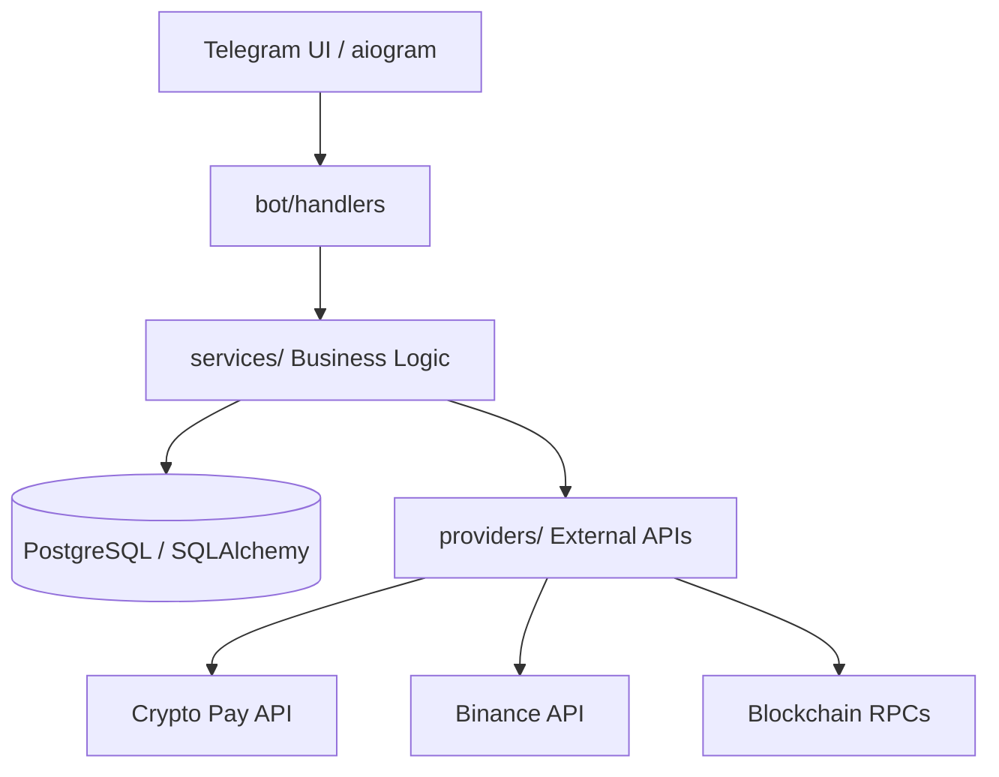

# 💎 p2pCryptoBot — Premium P2P Escrow System


<p align="left">
  
  
  
  
  
</p>

**p2pCryptoBot** is a high-robust, production-ready **P2P Crypto Trading Bot** for Telegram. It acts as a secure Escrow service between Buyers and Sellers, ensuring trade safety through integration with **Crypto Pay API** and direct blockchain interactions (EVM/TON).

---

## ✨ Key Features

*   **🔒 Secure Escrow**: Automated fund holding during the trade lifecycle.
*   **💳 Multi-Currency**: Support for BTC, ETH, TON, USDT, and more via Crypto Pay.
*   **🧬 Web3 Wallets**: Real on-chain wallet generation (EVM/TON) with private keys encrypted at rest (AES-256-GCM).
*   **📊 Market Data**: Live rates from Binance Spot API for precise ad pricing.
*   **🤝 Integrated Chat**: Anonymous messaging between Maker and Taker within the bot.
*   **⚖️ Dispute System**: Moderator dashboard for conflict resolution with AI-assisted chat analysis.
*   **🛠️ Admin Dashboard**: Deep analytics, volume statistics, and dispute queue management.

---

## 🏗️ System Architecture

The project follows a strict layered architecture to ensure testability and scalability.



---

## 🚀 Quick Start (5 minutes)

### Prerequisites
- Docker + Docker Compose
- A Telegram bot token from [@BotFather](https://t.me/BotFather)
- A Crypto Pay token from [@CryptoBot](https://t.me/CryptoBot)

### One-Command Deploy

```bash
git clone <your-repo-url> p2pbot
cd p2pbot
sh setup.sh
```

The setup wizard will:
1. Ask for your bot and payment tokens
2. Generate all cryptographic secrets automatically
3. Start the bot in Docker
4. Print a success summary

### Customization

Edit `branding.yaml` to customize your bot name, fees, and messages — no Python required:
```yaml
bot:
  name: "My Custom Exchange"
  welcome_message: "👋 Welcome to {bot_name}, {first_name}!"
  support_handle: "@mysupport"
```

Then restart: `docker compose restart bot`

---

## ⚙️ Configuration (.env)

| Variable | Description | Default / Example |
| :--- | :--- | :--- |
| `BOT_TOKEN` | Telegram bot token from @BotFather | Required |
| `CRYPTOPAY_TOKEN` | API token from @CryptoBot | Required |
| `CRYPTOPAY_CALLBACK_SECRET` | Used to verify webhook signatures | Auto-generated |
| `POSTGRES_URI` | Database connection string | Auto-generated |
| `AES_KEY` | 64-char hex key for encryption | Auto-generated |
| `ADMIN_IDS` | Comma-separated admin Telegram IDs | Required |
| `GEMINI_API_KEY` | Google Gemini API key for AI Mediator | Optional |
| `ORDER_TIMEOUT_SEC` | Time before unfunded order expires | `1800` |
| `ORDER_MIN_AMOUNT_USDT` | Minimum trade amount in USDT | `1.0` |
| `ORDER_MAX_AMOUNT_USDT` | Maximum trade amount in USDT | `50000.0` |

---

## 🛡️ Security & Quality

| Check | What it validates |
|---|---|
| **208+ Tests** | Business logic, handlers, services, edge cases |
| **Bandit SAST** | Python security vulnerabilities (Phase 4) |
| **NIST AES-256-GCM** | Cryptographic correctness (Phase 5) |
| **pip-audit** | Dependency CVE scanning (Phase 4) |
| **HMAC-SHA256** | Webhook signature, timing-attack safe |
| **Pessimistic Locking** | No race conditions on concurrent order takes |
| **Idempotency Keys** | Safe to retry after crash |

---

## 🧪 Testing & Quality
We maintain high standards with >95% code coverage.

```bash
pytest          # Run tests
mypy .          # Type checking
ruff check .    # Linting & formatting
```

---

## 📁 Project Structure

*   `bot/`: UI Layer (Telegram handlers, keyboards, FSM).
*   `services/`: Business Logic (trades, escrow, disputes).
*   `db/`: Data models and Alembic migrations.
*   `providers/`: External API integrations (Crypto Pay, Exchanges).
*   `tasks/`: Background tasks (order cleanup, notifications).
*   `utils/`: Helper functions (encryption, formatting).

---

## 🗺️ Roadmap

- [x] **Phase 1**: Branding Abstraction (Zero hardcoded strings)
- [x] **Phase 2**: AI Mediator & Enhanced Notifications
- [x] **Phase 3**: Setup Automation & Quick Start Docs
- [ ] **Phase 4**: Security Scanning & CI Pipeline
- [ ] **Phase 5**: Cryptographic Hardening & Contract Tests
- [ ] **Phase 6**: Delivery Package & Final QA

---

## ⚠️ Security Notes

1.  **Exchange API Keys**: When adding keys, ensure **Withdraw** permissions are **disabled**.
2.  **Webhooks**: In production, configure `CRYPTOPAY_CALLBACK_SECRET` to verify Crypto Pay notifications.
3.  **AES_KEY**: Never change this key after users start saving API keys, as they won't be decryptable.

---
*Developed with ❤️ for secure trading.*