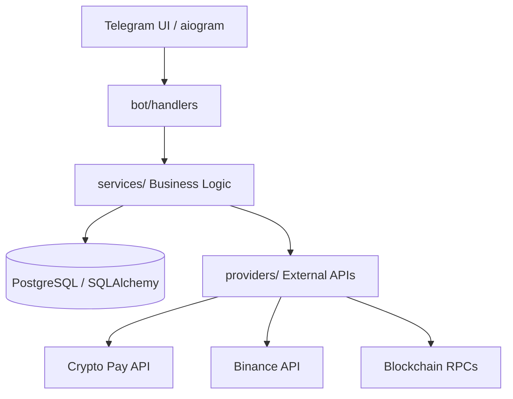

# 💎 p2pCryptoBot — Premium P2P Escrow System


<p align="left">
  
  
  
  
  
</p>

**p2pCryptoBot** is a high-robust, production-ready **P2P Crypto Trading Bot** for Telegram. It acts as a secure Escrow service between Buyers and Sellers, ensuring trade safety through integration with **Crypto Pay API** and direct blockchain interactions (EVM/TON).

---

## ✨ Key Features

*   **🔒 Secure Escrow**: Automated fund holding during the trade lifecycle.
*   **💳 Multi-Currency**: Support for BTC, ETH, TON, USDT, and more via Crypto Pay.
*   **🧬 Web3 Wallets**: Real on-chain wallet generation (EVM/TON) with private keys encrypted at rest (AES-256-GCM).
*   **📊 Market Data**: Live rates from Binance Spot API for precise ad pricing.
*   **🤝 Integrated Chat**: Anonymous messaging between Maker and Taker within the bot.
*   **⚖️ Dispute System**: Moderator dashboard for conflict resolution with AI-assisted chat analysis.
*   **🛠️ Admin Dashboard**: Deep analytics, volume statistics, and dispute queue management.

---

## 🏗️ System Architecture

The project follows a strict layered architecture to ensure testability and scalability.



---

## 🚀 Quick Start (5 minutes)

### Prerequisites
- Docker + Docker Compose
- A Telegram bot token from [@BotFather](https://t.me/BotFather)
- A Crypto Pay token from [@CryptoBot](https://t.me/CryptoBot)

### Deploy

```bash
git clone https://github.com/AlexKrivokorytov/p2pCryptoBot p2pbot
cd p2pbot
bash setup.sh          # guided wizard: collects tokens, generates secrets
# Edit branding.yaml   # set your bot name, fees, and payment methods
docker compose up -d --build
```

Done. Your bot is live. Check logs with `docker compose logs -f bot`.

### Local Development

```bash
python -m venv .venv
source .venv/bin/activate  # Windows: .venv\Scripts\activate
pip install -e ".[dev]"
alembic upgrade head
python -m bot.main
```

---

## ⚙️ Configuration (.env)

| Variable | Description |
| :--- | :--- |
| `BOT_TOKEN` | Your token from @BotFather |
| `CRYPTOPAY_TOKEN` | API token from @CryptoBot (Crypto Pay) |
| `POSTGRES_URI` | Database connection string |
| `AES_KEY` | 64-character hex key for wallet encryption |
| `ADMIN_IDS` | Comma-separated Telegram IDs of admins |
| `GEMINI_API_KEY` | Key for AI Mediator (Gemini) |

---

## 🧪 Testing & Quality
We maintain high standards with >95% code coverage.

```bash
pytest          # Run tests
mypy .          # Type checking
ruff check .    # Linting & formatting
```

---

## 📁 Project Structure

*   `bot/`: UI Layer (Telegram handlers, keyboards, FSM).
*   `services/`: Business Logic (trades, escrow, disputes).
*   `db/`: Data models and Alembic migrations.
*   `providers/`: External API integrations (Crypto Pay, Exchanges).
*   `tasks/`: Background tasks (order cleanup, notifications).
*   `utils/`: Helper functions (encryption, formatting).

---

## 🗺️ Roadmap

- [x] **P2P Engine**: Order lifecycle, escrow via Crypto Pay, pessimistic locking.
- [x] **Chats & Profiles**: Anonymous Maker-Taker messaging, user profiles.
- [x] **Admin Panel**: Dispute queue, platform statistics, moderator actions.
- [x] **AI Mediator**: Gemini 2.0 Flash integration for automated dispute analysis.
- [x] **Branding System**: Zero-Python customization via `branding.yaml`.
- [x] **Notifications**: Full lifecycle notifications (taker found, fiat sent, escrow released, dispute, expiry).
- [ ] **Contract Tests**: NIST AES-256-GCM vectors + Crypto Pay API contract tests (Phase 5).
- [ ] **On-Chain Escrow**: Fully decentralized escrow via smart contracts (future).

---

## ⚠️ Security Notes

1.  **Exchange API Keys**: When adding keys, ensure **Withdraw** permissions are **disabled**.
2.  **Webhooks**: In production, configure `CRYPTOPAY_CALLBACK_SECRET` to verify Crypto Pay notifications.
3.  **AES_KEY**: Never change this key after users start saving API keys, as they won't be decryptable.

---
*Developed with ❤️ for secure trading.*