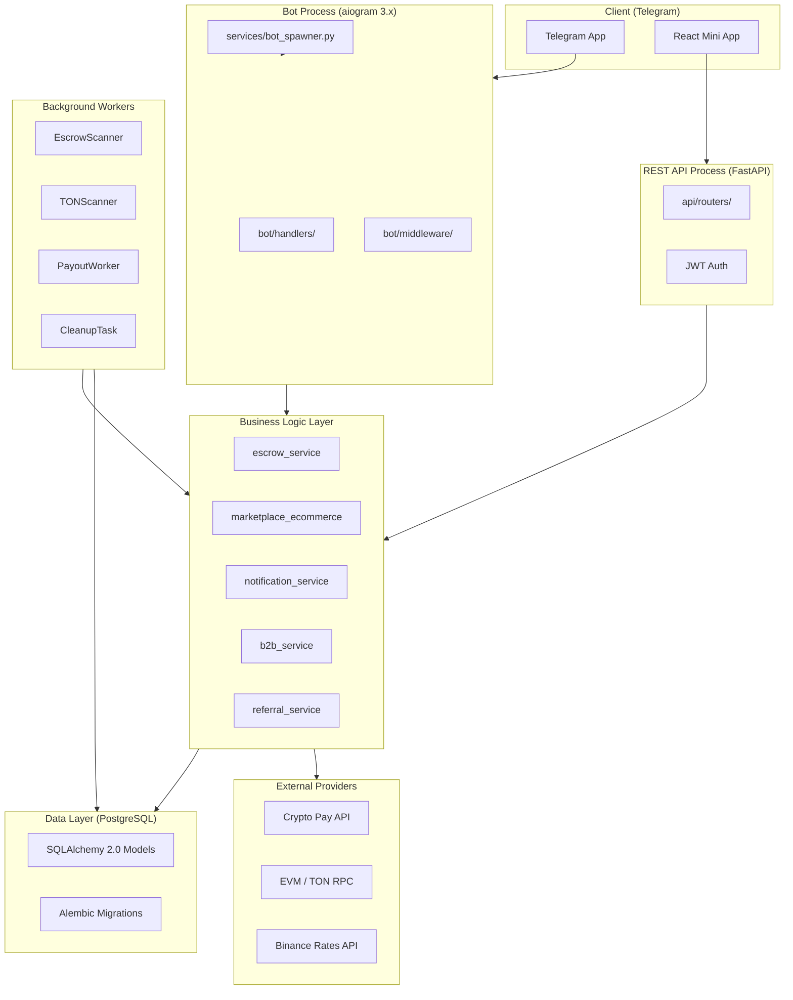

<p align="center">
  <h1 align="center">⚡ p2pCryptoBot</h1>
  <p align="center"><b>Production-grade B2B White-Label P2P Escrow SaaS Platform</b></p>
</p>

<p align="center">
  
  
  
  
  
  
  
  
</p>

---

> **p2pCryptoBot** is a multi-phase SaaS platform that lets anyone launch a fully white-labeled P2P crypto trading and digital marketplace bot on Telegram — no infrastructure experience required. One Docker command, your own bot, your own branding, your own fees.

---

## 🗺️ What Is This?

| Layer | What it does |
|---|---|
| **P2P Escrow Engine** | Secure Maker ↔ Taker trades with Crypto Pay + pessimistic DB locking |
| **Digital Marketplace** | Telegram Mini App store for digital goods (Stars / Crypto / Fiat) |
| **B2B SaaS** | White-label bot instances with per-client branding and license keys |
| **Blockchain** | On-chain EVM + TON wallet generation, escrow, and payout automation |
| **REST API** | FastAPI backend serving the React Mini App + webhook processing |

---

## 📊 Current Development Status

| Phase | Feature | Status |
|---|---|---|
| **1** | Core P2P Escrow Engine (order lifecycle, Crypto Pay, pessimistic locking) | ✅ Complete |
| **1** | Admin Dashboard + Dispute Queue | ✅ Complete |
| **2** | White-Label Branding via `branding.yaml` | ✅ Complete |
| **2** | NIST AES-256-GCM Encrypted Wallets (EVM + TON) | ✅ Complete |
| **2** | Anonymous Maker-Taker Chat | ✅ Complete |
| **3** | Telegram Stars Payments + Marketplace | ✅ Complete |
| **3** | React Mini App Frontend (Vite + TypeScript) | ✅ Complete |
| **3** | Promo Codes + Referral Rewards | ✅ Complete |
| **4** | TON Native Payments + On-Chain Escrow Scanner | ✅ Complete |
| **4** | Automated Seller Payout Worker | ✅ Complete |
| **5** | Multi-Bot SaaS Management (BotSpawner) | 🔄 In Progress |
| **5** | Self-Service License Purchase via Stars | 🔄 In Progress |
| **—** | On-chain Smart Contract Escrow | ⬜ Planned |

---

## 🏗️ Platform Architecture



---

## 🛡️ Security & Quality

| Check | Status | What it validates |
|---|---|---|
| **Test Suite** | ✅ 480+ tests | Business logic, services, concurrency, edge cases |
| **Coverage** | ✅ ≥ 90% | Code coverage enforced in CI |
| **mypy --strict** | ✅ Passing | Full static type safety across 100+ files |
| **ruff** | ✅ Passing | Linting + formatting |
| **Bandit SAST** | ✅ 0 findings | Python security vulnerabilities (medium+) |
| **NIST AES-256-GCM** | ✅ Validated | Crypto correctness against official test vectors |
| **pip-audit** | ✅ 0 CVEs | Dependency vulnerability scanning |

### 🔐 Cryptographic Security

- **AES-256-GCM** — private keys encrypted at rest, validated against [NIST SP 800-38D](https://csrc.nist.gov/publications/detail/sp/800-38d/final)
- **HMAC-SHA256** — webhook verification with `hmac.compare_digest` (timing-attack resistant)
- **96-bit random nonce** per encryption — nonce reuse impossibility tested
- **AES key** is never logged, never hardcoded, never exposed in `repr()`

### 💰 Financial Safety

- **Pessimistic locking** (`SELECT ... FOR UPDATE`) on every balance/status mutation
- **Idempotency keys** (`spend_id`) on every Crypto Pay + TON transfer
- **Concurrent order acceptance** tested: 3 simultaneous takers, exactly 1 wins
- **Self-deal prevention** — maker cannot take their own order

---

## 🚀 Quick Start (Docker — 3 steps)

### Prerequisites
- Docker + Docker Compose
- Telegram bot token from [@BotFather](https://t.me/BotFather)
- Crypto Pay token from [@CryptoBot](https://t.me/CryptoBot)

```bash
# 1. Clone and configure
git clone https://github.com/AlexKrivokorytov/p2pCryptoBot
cd p2pCryptoBot
cp .env.example .env
# Edit .env with your tokens

# 2. Run guided setup
bash setup.sh   # generates AES_KEY, walks you through configuration

# 3. Launch
docker compose up -d --build
```

Your bot is live. Check logs with:
```bash
docker compose logs -f bot
```

API docs available at `http://localhost:8000/docs`.

---

## 📁 Project Structure

```
p2pCryptoBot/
├── bot/                    # Telegram UI layer (aiogram handlers, keyboards, FSM)
│   ├── handlers/           # One file per feature area
│   ├── keyboards.py        # All inline keyboards
│   ├── middleware.py       # Auth, rate limit, license check
│   └── config.py           # Settings + branding loader
│
├── services/               # Business logic (no Telegram imports)
│   ├── escrow_service.py   # P2P escrow lifecycle
│   ├── marketplace_ecommerce.py  # Digital marketplace deals
│   ├── file_delivery.py    # Secure digital goods access
│   ├── notification_service.py   # P2P push notifications
│   ├── marketplace_notifications.py  # Marketplace push notifications
│   ├── b2b_service.py      # White-label license management
│   ├── referral_service.py # Referral rewards
│   └── wallet_service.py   # On-chain wallet operations
│
├── providers/              # External API clients
│   ├── crypto_pay.py       # Crypto Pay API (no SDK)
│   ├── wallet_provider.py  # EVM + TON + Solana key generation
│   └── rate_provider.py    # Binance/OKX live rates
│
├── db/                     # Data layer
│   ├── models/             # SQLAlchemy 2.0 mapped models
│   └── migrations/         # Alembic migrations
│
├── tasks/                  # Background workers (asyncio)
│   ├── escrow_scanner.py   # Auto-cancel stale escrows
│   ├── ton_scanner.py      # On-chain TON invoice monitoring
│   ├── payout_worker.py    # Auto-release funds to seller
│   └── cleanup.py          # Daily maintenance tasks
│
├── api/                    # FastAPI REST backend
│   └── routers/            # Marketplace, deals, files, webhooks
│
├── frontend/               # React Mini App (Vite + TypeScript)
│   └── src/
│       ├── pages/          # Marketplace, Seller, Deal pages
│       └── api/            # Typed API client
│
├── utils/                  # Shared utilities
│   ├── encryption.py       # AES-256-GCM (NIST validated)
│   └── hmac_helpers.py     # Webhook signature verification
│
├── tests/                  # 480+ tests (unit/contract/integration/b2b)
├── branding.yaml           # Your brand config (name, fees, messages)
├── docker-compose.yml      # One-command deploy
└── setup.sh                # Guided setup wizard
```

---

## ⚙️ Configuration (.env)

| Variable | Required | Description |
|---|---|---|
| `BOT_TOKEN` | ✅ | Your token from @BotFather |
| `CRYPTOPAY_TOKEN` | ✅ | API token from @CryptoBot |
| `CRYPTOPAY_CALLBACK_SECRET` | ✅ | Secret for HMAC webhook verification |
| `POSTGRES_URI` | ✅ | Database connection string |
| `AES_KEY` | ✅ | 64-char hex key for wallet encryption |
| `ADMIN_IDS` | ✅ | Comma-separated Telegram IDs of admins |
| `MASTER_TON_WALLET` | ✅ | TON wallet for receiving B2B payments |
| `MASTER_BOT_USERNAME` | ⬜ | Bot username for Mini App deep links |
| `LICENSE_KEY` | ⬜ | License key (for white-label deployments) |

See [`.env.example`](.env.example) for the full list with descriptions.

---

## 🧪 Testing & Quality

```bash
# Run all 480+ tests
docker exec p2pbot-api-1 python -m pytest

# Type checking
mypy --strict bot/ services/ providers/ utils/ tasks/ db/

# Linting + formatting
ruff check . --fix && ruff format .

# Security audit
bandit -r . -ll
pip-audit
```

Test markers:

| Marker | Description |
|---|---|
| `unit` | Pure logic, no I/O, all external calls mocked |
| `contract` | Validates provider API response shapes |
| `integration` | Live PostgreSQL required, tests concurrency & locking |
| `b2b` | End-to-end B2B flows (Stars/TON payments, bot spawning) |

---

## 🎨 White-Label Branding

Zero-Python customization via `branding.yaml`:

```yaml
bot:
  name: "MyExchangeBot"
  welcome_message: "Welcome to MyExchange, {first_name}! 🚀"
  support_handle: "@myexchange_support"

fees:
  maker_percent: 0.5
  taker_percent: 1.0
  fixed_fee: 0.0

assets_enabled: ["USDT", "TON", "BTC", "ETH"]
payment_methods: ["Sberbank", "Tinkoff", "QIWI"]
```

---

## 🤝 Contributing

See [CONTRIBUTING.md](CONTRIBUTING.md) for setup guide, layer rules, and commit conventions.

---

## 📄 License & Pricing

See [PRICING.md](PRICING.md) for license terms and pricing information.

---

*Built with ❤️ for secure trading. Protected by commercial license — redistribution prohibited.*