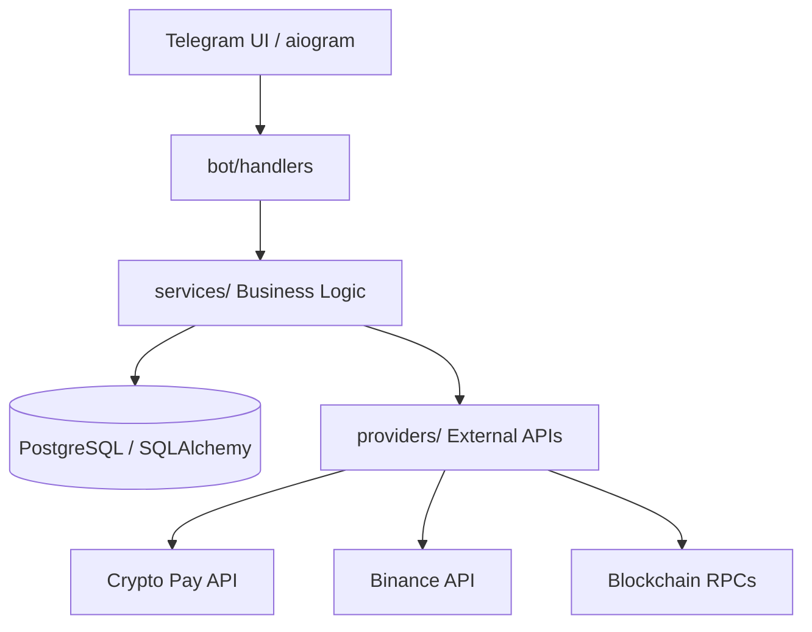

# 💎 p2pCryptoBot — Premium P2P Escrow System

<p align="left">
  
  
  
  
  
  
</p>

**p2pCryptoBot** is a high-robust, production-ready **P2P Crypto Trading Bot** for Telegram. It acts as a secure Escrow service between Buyers and Sellers, ensuring trade safety through integration with **Crypto Pay API** and direct blockchain interactions (EVM/TON).

---

## 🛡️ Security & Quality Certifications

| Check | Status | What it validates |
|---|---|---|
| **Test Suite** | ✅ 266+ tests | Business logic, services, concurrency, edge cases |
| **Coverage** | ✅ ≥ 85% | Code coverage enforced in CI |
| **Bandit SAST** | ✅ 0 findings | Python security vulnerabilities (medium+) |
| **Semgrep** | ✅ Passing | OWASP Top 10, secrets detection, SQL injection |
| **Trivy** | ✅ 0 CRITICAL/HIGH | Docker image CVE scan |
| **CodeQL** | ✅ Active | GitHub's advanced security analysis |
| **NIST AES-256-GCM** | ✅ Validated | Crypto correctness against official test vectors |
| **pip-audit** | ✅ 0 CVEs | Dependency vulnerability scanning |

### 🔐 Cryptographic Security Details

- **AES-256-GCM** encryption for private keys — validated against
  [NIST SP 800-38D](https://csrc.nist.gov/publications/detail/sp/800-38d/final) official test vectors
- **HMAC-SHA256** webhook verification with `hmac.compare_digest` — timing-attack resistant
- **96-bit random nonce** per encryption — nonce reuse impossibility validated by 100-sample test
- **AES key** is never logged, never hardcoded, never exposed in `repr()`
- **License Key** bound to Telegram Bot Token via HMAC-SHA256 — prevents unauthorized redistribution

### 💰 Financial Safety Details

- **Pessimistic locking** (`SELECT ... FOR UPDATE`) on every balance/status mutation
- **Idempotency keys** (`spend_id`) on every Crypto Pay transfer — safe to retry after crash
- **Concurrent order acceptance** tested: 3 simultaneous takers, exactly 1 wins (DB locks guarantee)
- **Self-deal prevention** — maker cannot take their own order

---

## ✨ Key Features

*   **🔒 Secure Escrow**: Automated fund holding during the trade lifecycle.
*   **💳 Multi-Currency**: Support for BTC, ETH, TON, USDT, and more via Crypto Pay.
*   **🧬 Web3 Wallets**: Real on-chain wallet generation (EVM/TON) with private keys encrypted at rest (AES-256-GCM).
*   **📊 Market Data**: Live rates from Binance Spot API for precise ad pricing.
*   **🤝 Integrated Chat**: Anonymous messaging between Maker and Taker within the bot.
*   **⚖️ Dispute System**: Moderator dashboard for conflict resolution with AI-assisted chat analysis.
*   **🛠️ Admin Dashboard**: Deep analytics, volume statistics, and dispute queue management.
*   **🤖 AI Mediator**: Gemini 2.0 Flash integration for automated dispute analysis.
*   **🎨 White-Label Ready**: Zero-Python customization via `branding.yaml` — change name, fees, emojis, messages without touching code.
*   **🔑 License Protection**: HMAC-SHA256 license keys bound to Telegram Bot ID — your IP stays yours.

---

## 🏗️ System Architecture

The project follows a strict layered architecture to ensure testability and scalability.



---

## 🚀 Quick Start (5 minutes)

### Prerequisites
- Docker + Docker Compose
- A Telegram bot token from [@BotFather](https://t.me/BotFather)
- A Crypto Pay token from [@CryptoBot](https://t.me/CryptoBot)
- A valid **LICENSE_KEY** from your vendor

### Deploy

```bash
# 1. Extract the delivery package
unzip p2pbot-whitelabel-v1.0.zip
cd p2pbot-whitelabel

# 2. Run the guided setup wizard
bash setup.sh   # collects tokens, generates secrets, creates .env and branding.yaml

# 3. Launch
docker compose up -d --build
```

Done. Your bot is live. Check logs with `docker compose logs -f bot`.

### Local Development

```bash
python -m venv .venv
source .venv/bin/activate  # Windows: .venv\Scripts\activate
pip install -e ".[dev]"
alembic upgrade head
python -m bot.main
```

> **Note:** In development mode (no `SELLER_SECRET` set), the license check is skipped automatically.

---

## ⚙️ Configuration (.env)

| Variable | Required | Description |
| :--- | :--- | :--- |
| `BOT_TOKEN` | ✅ | Your token from @BotFather |
| `LICENSE_KEY` | ✅ | License key from your vendor (bound to this bot token) |
| `CRYPTOPAY_TOKEN` | ✅ | API token from @CryptoBot (Crypto Pay) |
| `CRYPTOPAY_CALLBACK_SECRET` | ✅ | Secret for HMAC webhook verification |
| `POSTGRES_URI` | ✅ | Database connection string |
| `AES_KEY` | ✅ | 64-character hex key for wallet encryption |
| `ADMIN_IDS` | ✅ | Comma-separated Telegram IDs of admins |
| `GEMINI_API_KEY` | ⬜ | Key for AI Mediator (Gemini) — optional |

---

## 🧪 Testing & Quality
We maintain high standards with ≥ 85% code coverage.

```bash
pytest          # Run 266+ tests
mypy .          # Type checking
ruff check .    # Linting & formatting
bandit -r . -ll # Security audit
```

---

## 📁 Project Structure

*   `bot/`: UI Layer (Telegram handlers, keyboards, FSM).
*   `services/`: Business Logic (trades, escrow, disputes).
*   `db/`: Data models and Alembic migrations.
*   `providers/`: External API integrations (Crypto Pay, Exchanges).
*   `tasks/`: Background tasks (order cleanup, notifications).
*   `utils/`: Helper functions (encryption, formatting, license guard).

---

## 🗺️ Roadmap

- [x] **P2P Engine**: Order lifecycle, escrow via Crypto Pay, pessimistic locking.
- [x] **Chats & Profiles**: Anonymous Maker-Taker messaging, user profiles.
- [x] **Admin Panel**: Dispute queue, platform statistics, moderator actions.
- [x] **AI Mediator**: Gemini 2.0 Flash integration for automated dispute analysis.
- [x] **Branding System**: Zero-Python customization via `branding.yaml`.
- [x] **Notifications**: Full lifecycle notifications (taker found, fiat sent, escrow released, dispute, expiry).
- [x] **Contract Tests**: NIST AES-256-GCM vectors + Crypto Pay API contract tests.
- [x] **License Protection**: HMAC-SHA256 keys bound to Bot Token — anti-piracy guard.
- [ ] **On-Chain Escrow**: Fully decentralized escrow via smart contracts (future).

---

## ⚠️ Security Notes

1.  **Exchange API Keys**: When adding keys, ensure **Withdraw** permissions are **disabled**.
2.  **Webhooks**: In production, configure `CRYPTOPAY_CALLBACK_SECRET` to verify Crypto Pay notifications.
3.  **AES_KEY**: Never change this key after users start saving API keys, as they won't be decryptable.
4.  **LICENSE_KEY**: Your license is bound to your specific `BOT_TOKEN`. It will not work with a different bot.

---

*Developed with ❤️ for secure trading. Protected by commercial license — redistribution prohibited.*